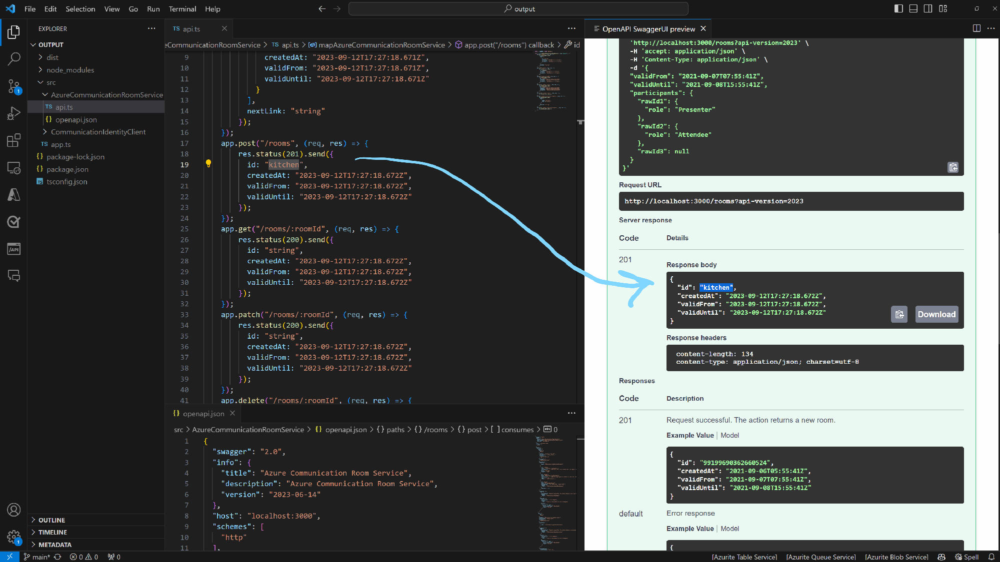

# api-moka

👷🏻‍♂️ **Generate a mock service / emulator from OpenAPI specs!**

This tool creates a simple Express/NodeJS server from a given OpenAPI spec file or url. Once created you can run a client against the emulated API and make live changes to the emulated service.

It's useful to mock out dependencies for speeding up development, especially in a microservice environment where there are a lot of service dependencies.

### Prerequisites

- VS Code
- OpenApi VS Code extension that can preview OpenAPI with the Swagger Editor
- Node 18
- TypeScript installed globally

### Generate the emulator

Build the tool and install (public npm package will be coming):

```
npm i
npm run build
npm i -g
```

Run it:

```
api-moka -o "mocks" -s "test/communicationservicesrooms.json" "https://raw.githubusercontent.com/Azure/azure-rest-api-specs/main/specification/communication/data-plane/Identity/stable/2023-08-01/CommunicationIdentity.json" --run
```

This command

- generates a simple Express server for your APIs
- opens the new project in VS Code
- builds the server and starts it
- hot-reload is supported!
- to only generate the code, don't pass the --run argument

The structure of the generated server is as follows:

```
src/
  {service}/
    api.ts
    openapi.json
  app.ts
```

### Try it!

While the generated emulator is running:

- Open an `openapi.json` from one of the services and launch the preview to see it in Swagger Editor
- Open the corresponding `api.ts` side-by-side
- In Swagger Editor, choose a route and click "Try It"
- Fill in all required request properties and headers
- Click "Execute"
- You can see the returned response from the emulator!
- To change the returned response, edit the route in `api.ts` and save the file
- Wait until hot-reload did its thing and execute the request again, you will see your changes in the response.


